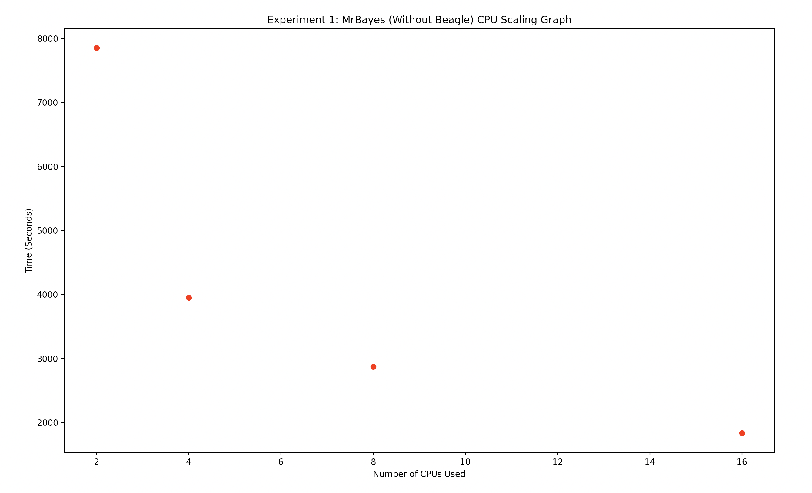
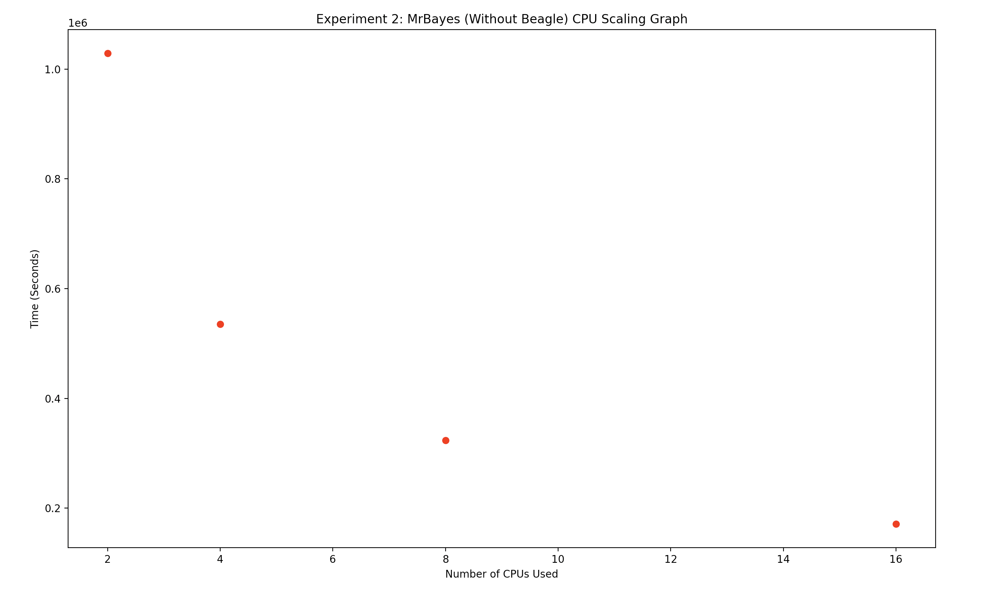

# general info on MrBayes + whiteflies and algae datasets

**What is MrBayes and how is it used by research labs?**

MrBayes is a software package that helps research labs perform Bayesian Phylogenetic inference. Essentially, it helps researchers make predictions about an organism and/or its genetic history based on existing genetic data. MrBayes uses Markov Chain Monte Carlo methods in order to make these inferences.

**Describe an advantage of implementing the Beagle lib with MrBayes**

The Beagle library provides tools to optimally perform calculations commonly used for Bayesian inference. Beagle takes advantage of hardware, and can more effectively make use out of highly-parallel processors - particularly, GPUs. Because MrBayes does Bayesian inference, if such highly-parallel hardware is available to researchers, then it would make sense to implement the Beagle lib with MrBayes in order to optimize required calculations and to optimize use of hardware. In fact, according to Ronquist et al. (2012), the speedup is more than 50x when using the Beagle lib with MrBayes with codon problems (a codon is a term in genetics that denotes the representation of amino acids by three consecutive nucleotides). Such speedup can completely change the circumstances of research labs on a time crunch; something that would have taken almost 2 months, for example, would get reduced to just 1 day.

**What is the importance of identifying the origin of whiteflies?**

Whiteflies are significant pest and invasive species, damaging food and fiber crops as well as spreading plant viruses. Due to the 'morphologically indistinguishable' nature of the species complex, it has been dificult to identify which species an organism belongs to, slowing down research progress. Boykin and De Barro's paper illustrates single-gene (mtCOI) based species identification methdologies that can also be generalized to other morphologically similar species.

**From the perspective of an evolutionary biologist, why is it necessary to improve the phylogeny of a model system such as the volvocine algae?**

One of the primary reasons to study volvocine algae is to understand the evolution of multicellularity in life. Multicellularity is one of the most important developments in life because it is what brought about most of modern visible life on Earth; understanding how it came about will in turn help us gain a deeper understanding of evolution in general. Volvocine algae are an example of a species that can be studied to gain insights into multicellularity, because they range from single celled all the way up to 50,000 celled organisms, depending on the species. Because of this range, and particularly the inclusion of single celled species, the volvocine algae provide a good model for the origin of multicellularity - hence the reason they are called a "model system". In order to gain a fuller understanding of the origin of multicellularity, cell biology is superimposed on molecular phylogeny - which only works if the phylogeny is as accurate as possible. This is why it is important to improve the phylogeny of a model system such as the volvocine algae.

# Experiment 1
**Briefly describe your scaling results and why certain builds perform better (i.e., faster completion time).**
* Serial (rsrc: mem-per-cpu=0, node=1, exclusive); baseline

| ntasks | cpus-per-task | mcmc time | walltime |
| ------ | ------------- | --------- | -------- |
| 1      | 1             | 4:37:38   | 4:39:14  |

* MPI without Beagle, CPU (rsrc: mem-per-cpu=0, node=1, ntasks-per-node=#, exclusive)

| ntasks | cpus-per-task | mcmc time | walltime | mcmc speedup | CPU-core effeciency |
| ------ | ------------- | --------- | -------- | ------------ | ------------------- |
| 1      | 1             | 4:17:03   | 4:18:42  | 1.08x        | 108%                |
| 2      | 1             | 2:05:02   | 2:06:39  | 2.22x        | 111%                |
| 4      | 1             | 1:09:18   | 1:10:55  | 4.01x        | 100%                |
| 8      | 1             | 0:50:42   | 0:52:19  | 5.48x        | 68%                 |
| 16     | 1             | 0:32:15   | 0:33:52  | 8.61x        | 54%                 |

* MPI with Beagle, CPU (rsrc: mem-per-cpu=0, node=1, ntasks-per-node=#, exclusive)
  * Note: runs did not converge

| beagle_ver | ntasks | cpus-per-task | mcmc time | walltime | mcmc speedup | CPU-core effeciency |
| ---------- | ------ | ------------- | --------- | -------- | ------------ | ------------------- |
| v3.1.2     | 2      | 1             | 0:57:00   | 0:58:53  
| v3.1.2     | 4      | 1             | 0:30:35   | 0:32:21
| v4.0.1     | 4      | 1             | 0:41:27   | 0:43:13
| v3.1.2     | 8      | 1             | 0:23:27   | 0:25:14
| v3.1.2     | 16     | 1             | 0:20:59   | 0:22:46

* MPI with Beagle, 1 GPU (rsrc: mem-per-cpu=0, node=1, ntasks-per-node=#, gres=gpu:V100:1, exclusive)
  * Note: runs did not converge

|  beagle_ver  | ntasks | cpus-per-task | mcmc time | walltime | mcmc speedup | parallel effeciency |
| ------------ | ------ | ------------- | --------- | -------- | ------------ | ------------------- |
| v3.1.2 (GPU) | 1      | 1             | 2:54:15   | 2:56:17
| v3.1.2 (GPU) | 2      | 1             | 1:33:30   | 1:35:26  
| v3.1.2 (CPU) | 4      | 1             | 0:46:59   | 0:48:58

* Hybrid (rsrc: mem-per-cpu=0, node=1, ntasks-per-node=#, cpus-per-task=#, exclusive); using 16 hyperthreaded CPU-cores
  * Note: runs did not converge

| ntasks | cpus-per-task | mcmc time (s) | walltime | mcmc speedup | parallel effeciency |
| ------ | ------------- | ------------- | -------- | ------------ | ------------------- |
| 1      | 16            | 31411         | 8:59:47
| 2      | 8             | 4782          | 1:36:19
| 4      | 4             | 2593          | 0:58:18
| 8      | 2             | 2711          | 0:59:45
| 16     | 1             | 2804          | 1:02:08

**Choose one of the MrBayes MPI builds (b or c from above) and create a scaling graph for 2, 4, 8, and 16 cpus. Concisely describe the observed scaling when more cpus are added.**

To produce the scaling graph, we ran the program again using 2, 4, 8, and 16 cpus on the MPI version of MrBayes without Beagle. Here are the results:

| # cpus | time (seconds) |
| ------ | -------------- |
| 2      | 7854           |
| 4      | 3947           |
| 8      | 2868           |
| 16      | 1832          |

The script to produce the graph is included in experiment1.py

The scaling does not appear to be linear when more CPUs are added. As the number of CPUs increases, the runtime decreases; however, the rate of change of decrease in runtime is decreasing (i.e. the graph is concave up). It seems that we are reaching a plateau, and will not see large improvements in runtime if we use more than 16 CPUs.

**For Hybrid MrBayes, describe how you allocated MPI processes and OpenMP threads to
increase performance.**

**Consensus Tree Visualization**

**Results for Unknown Strains**
| Strain | Country/Continent | Genus | Species |
| ------ | ----------------- | ----- | ------- |
| Unknown 1 | Columbia | 
| Unknown 2 | Japan    |
| Unknown 3 | Cameroon |

# Experiment 2
**Briefly describe your scaling results and why certain builds perform better (i.e., faster completion time).**

**Choose one of the MrBayes MPI builds (b or c from above) and create a scaling graph for 2, 4, 8, and 16 cpus. Concisely describe the observed scaling when more cpus are added.**

Similar to experiment 1, to produce the scaling graph, we ran the program again using 2, 4, 8, and 16 cpus on the MPI version of MrBayes without Beagle. Here are the results:

| # cpus | time (seconds) |
| ------ | -------------- |
| 2      | 1028970        |
| 4      | 535198         |
| 8      | 323676         |
| 16      | 170829        |

The script to produce the graph is included in experiment2.py

This graph looks almost identical to what we saw in Experiment 1, just with larger values for the time taken. Here we also see that as the number of CPUs increases, the runtime decreases; however, the rate of change of decrease in runtime is decreasing (i.e. the graph is concave up). It again seems that we are reaching a plateau, and will not see large improvements in runtime if we use more than 16 CPUs.

**For Hybrid MrBayes, describe how you allocated MPI processes and OpenMP threads to
increase performance.**

